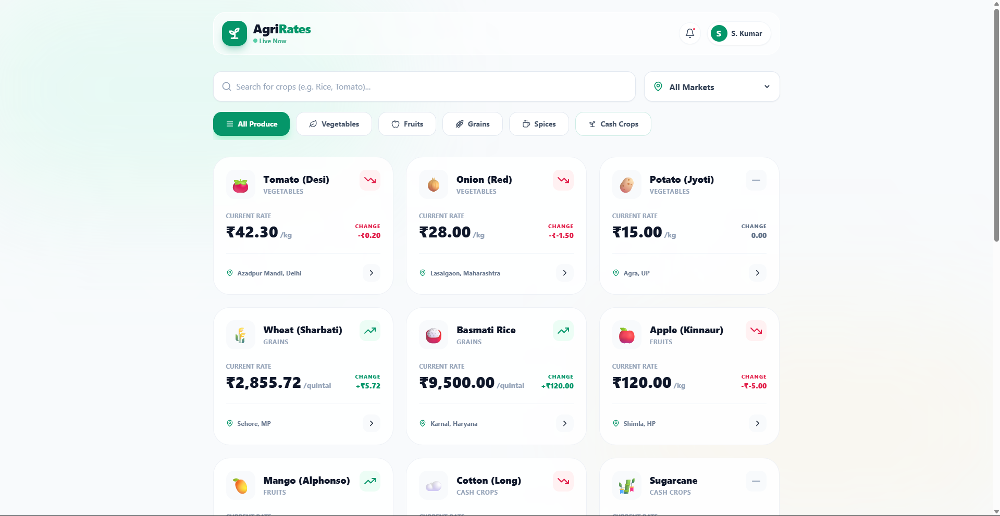
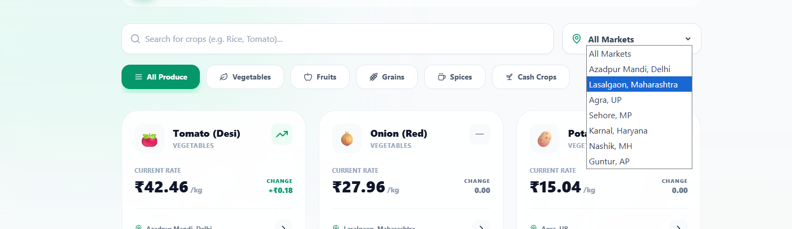

# AgriRates Tech Stack & Implementation Report

## Overview
AgriRates is a smart price intelligence web application for farmers, delivering real-time mandi prices securely and intuitively. The application is built entirely as a streamlined Single Page Application (SPA) prioritizing performance, aesthetics, and responsiveness.

## Technology Stack
- **Framework**: React 18
- **Build Tool**: Vite (for rapid HMR and optimized production bundles)
- **Styling**: Tailwind CSS (for highly customizable, utility-first styling and glassmorphism themes)
- **Icons**: Lucide React (for crisp, clean SVG icons)
- **State Management**: React Hooks (`useState`, `useEffect`, `useMemo`)

---

## 1. Login Interface
The login interface incorporates a modern glassmorphism design with an embedded OTP and password-based login toggle.

**Key Features:**
- Dual authentication methods (OTP vs Password)
- Biometric mock integration
- Real-time language toggling (UI skeleton designed for i18n)

---

## 2. Platform Dashboard (Homepage)
The main dashboard serves as the central intelligence hub, dynamically simulating live market pricing.

**Key Features:**
- **Dynamic Data Updates**: Utilizing `useEffect` combined with `setInterval` to mock live trading price fluctuations.
- **Glassmorphic Cards**: Each crop item relies on customized Tailwind properties (`bg-white/90`, `backdrop-blur-md`) to stand out against the ambient background blobs.
- **Trend Indicators**: Positive (`TrendingUp`), neutral (`Minus`), and negative (`TrendingDown`) visual anchors mapped to color-coded themes (emerald, slate, rose).

---

## 3. Search and Filtering
The application offers robust filtering to allow farmers to quickly find specific crop prices.

**Key Features:**
- **Memoized Filtering**: Using React's `useMemo` to efficiently filter data without causing unnecessary re-renders when data drifts in the background.
- **Multi-parameter Sorting**: Capable of cross-referencing search strings (e.g. "Rice", "Tomato"), crop categories, and specific market locations.
- **Responsive Navigation**: A scrollable category pill-bar for mobile and desktop screens built with hidden scrollbars for optimal UX.

## Conclusion
The AgriRates architecture is lightweight yet highly interactive, demonstrating modern React patterns perfectly harmonized with Utility-first CSS to deliver an enterprise-grade experience tailored for agricultural intelligence.
